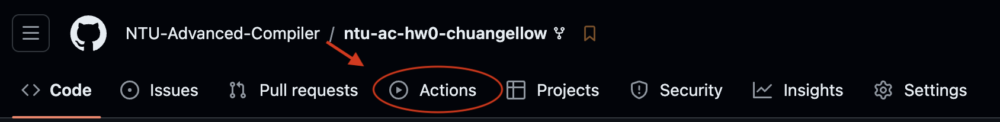
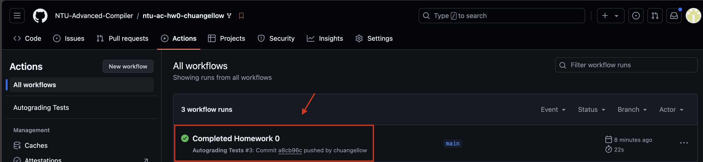
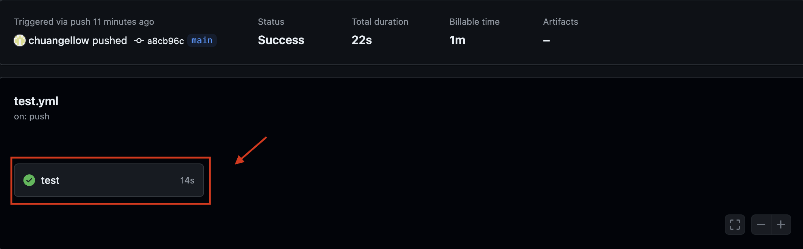
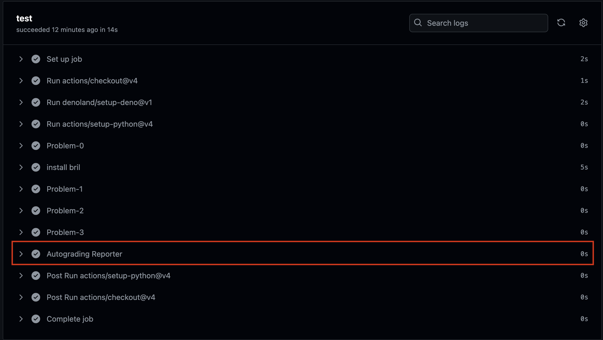
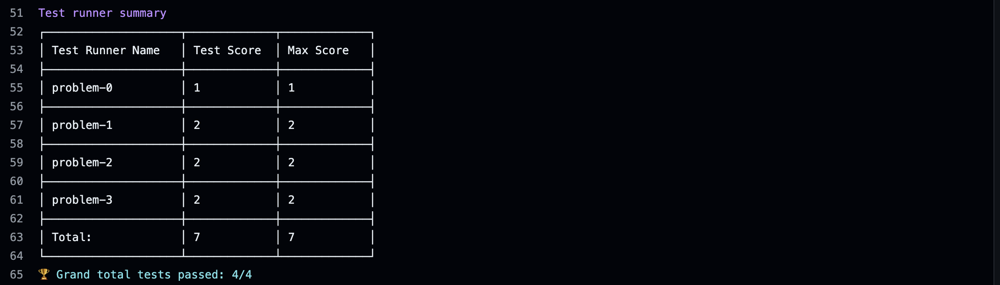

[](https://classroom.github.com/a/9j5CMziv)
Advanced Compiler Course - Homework 0
=======

# Introduction
This initial homework is designed to introduce you to the Bril (Big Red Intermediate Language) project and to help you set up your development environment.  
Bril is the intermediate representation (IR) that we will use extensively throughout this course.

# Getting Started

1. Clone your forked repository recursively to ensure you get the Bril submodule:

```=sh
git clone --recursive <url-of-your-forked-repo>
```

2. Carefully read and follow the instructions in the [Bril README](https://github.com/sampsyo/bril/blob/4029dd7b6440074bc4dd5557022848ef378f978a/README.md).
This document contains information on how to build the Bril toolchain, which is essential for completing this homework.

# Assignment Task

You need to complete the [install_bril.sh](install_bril.sh) script. This script will set up the Bril environment by installing necessary tools.

Here's what the script needs to do:

1. **Install Deno: (This might already be available in your environment)** 
   A modern runtime for JavaScript and TypeScript. This is used for the Bril interpreter.  
   Note: If Deno is missing in your environment, follow the instructions on [Deno](https://deno.com/) to install it.
2. **Install Flit:**
   Simplifies the process of putting Python packages on PyPI, used for Python tools in the Bril project.
3. **Install Bril Tools:**
   - **bril2json**: Converts Bril programs from text to JSON format.
   - **bril2txt**: Converts Bril programs from JSON back to text format.
   - **brili**: The Bril interpreter, which executes code from its JSON format.  
     Note: Install bril2json and bril2txt from the bril-txt directory, **NOT** from the bril-rs directory in the Bril project.

The script should ensure these tools are installed and accessible in the user's PATH.

Note: The script must work on any machine, not just yours. Ensure that the PATH modifications and installations are general enough to work on any system.


# GitHub Actions and Autograding

**Do not modify any files within the .github directory.**
  
Viewing Your Results:
1. **GitHub Actions Page**:
- Go to the "Actions" tab in your GitHub repository.
  

- Click on the latest workflow run.



2. **Autograding Reporter**:
- In the same workflow run page, look for the "Autograding Reporter" step.





- The "Grand total tests passed" will show you how many of the test cases you've successfully completed.



# Submission Guidelines

1. Complete the task in the [install_bril.sh](install_bril.sh) script.
2. Test your changes locally to ensure they work as expected.
3. Commit your changes to your forked repository:

```=sh
git add install_bril.sh
git commit -m "Completed Homework 0"
git push origin main
```
